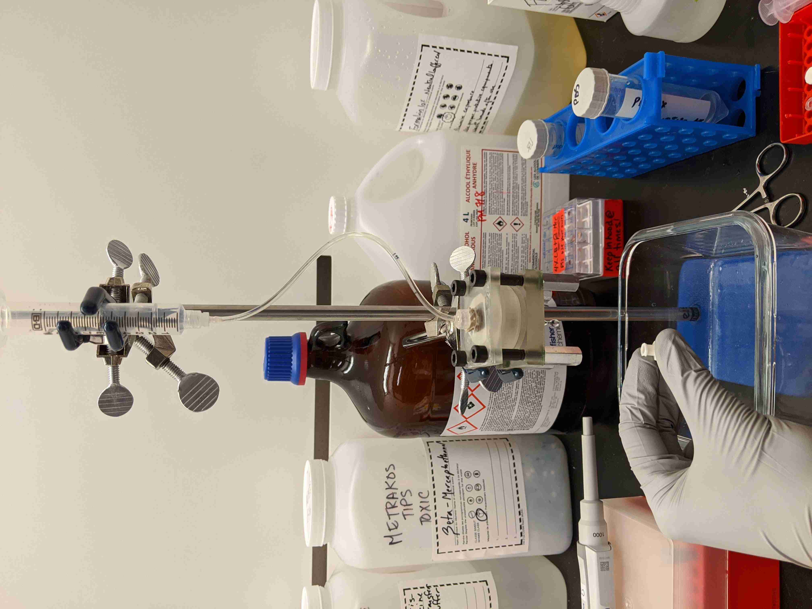

# SOP GuF Small #
Last update: 2021-03-04, NC

Time: 2h to 3h30m (to filter and fix sample)

### Abbreviations ###
- DW: distilled water
- Q: flow rate

### Materials ###
- 2x Polymer microfilters (8 and 15 um pore diameter, homemade)
- 2x Cartriges (printed, homemade)
- 4x 8x2 mm (IDxW) o-rings (_e.g.,_ McMaster 1185N92)
- 2x ~60 ml~ 50 ml, _thanks BD_, Luer-lock syringes, for reservoir
- 50 ml Tubes to dilute sample and collect filtrate
- 1-2x Locking hemostats or tube clamps (e.g, McMaster 5031K11)
- 4x Luer lock Plug-to-Socket Adapters, for syringe--tube interface (McMaster 51525K427)
- 3x Outlet needles: 26 Ga blunt steel dispensing needle, yellow (McMaster 75165A257)
- Tubing: 1/32" ID, 3/32" OD (_e.g.,_ McMaster 5233K91)
  - 2x 18 cm (inlet tubing)
  - 2x pieces to reach from syringe pump to cartridge
- 4x Luer lock plug caps, for closing cartridge during fixation steps (McMaster 51525K245)
  
### Solutions ###
- 2% BSA in PBS (4C)
- PBS 1X
- 0.05% pluronic in PBS
- 4% PFA for fixation

#### For Permeabilization and Blocking ####
- 0.2% Triton-X (filtered, store 4C)
- Blocking buffer (filtered, store 4C):
  - 0.1% Tween-20, 1% BSA, in PBS 
  - _for 250 ml: 2.5 g BSA + 250 ul Tween + 250 ml PBS_

# CTC CAPTURE BY GRAVITY FILTRATION #

*All solutions should be filtered/prepared using filtered PBS in order to reduce dust on the filters. Wash the cartridges and o-rings with DW before use.*

### Variations ###

- The backrinse step can be substituted with a forward rinse of 5 ml x2 PBS.
This decreases the chances of losing small CTCs during the rinse at the cost of
lowered purity (more WBCs).

## Coat Filters in BSA ##

_Comment: This step should be part of the fabrication, not the GuF SOP_

- Why: To prevent non-specific adsorption and reduce WBCs sticking to filter
- Incubate filters overnight in 2% BSA in PBS at 4C
- Filters may be loaded into the cartridge directly from their BSA bath. Filters not to be used immediately are placed be in a dish or well plate and stored until use.

## Loading filter on cartridge ##

_I've found it preferable to load the bolts from the top to the bottom of the cartridge as this results in the screws extending past the outlet and they can act as legs to stand on during the fixation and permiabilization steps._

1. Place the first o ring inside the notch
2. Add the 8um filter
3. Add the second o ring, followed by the silicone gasket
4. Repeat [1-3] with the stacking adapter and the 15um filter
5. Place the stacking assembly onto the base assembly, ensuring that their holes line up and are not obstructed by o rings
6. Place the top of the cartridge, aligning the o ring on top of the 15um filter with the notch. It may be easier to insert the bolts through the top cartridge before doing this.
7. Insert the bolts from top to bottom. Attach nuts to the bottom and tighten the assembly. This can be done without any tools (_i.e.,_ pinching the bolt and tightening the nut) and in my experience finger-tight is tight enough to run filtration without leaking.

## Platform setup and preload ##

1. Connect the dispensing needle to the outlet and clamp the cartridge onto a retort stand.
2. Remove the plunger from a 60 ml syringe to create a reservoir and connect it to the L1 tube (18 cm). Loosely clamp above the catridge
3. With slack in the L1, connect it to the catridge inlet. Pull the reservoir up to remove the slack and then clamp the reservoir at this height. The reservoir and L1 should be aligned as directly above the cartridge inlet as you can reasonably achieve.
4. Place something under the outlet to collect the filtrate (_e.g.,_ falcon tube, glass dish).
5. Preload system with 0.05% pluronic/PBS. Pour 10 ml into the reservoir and gently press down with the plunger to initiate flow. Remove the plugner, you should see solution dripping from the outlet needle at a steady rate.
6. Check the system for leaks and do a sanity check on the flow rate. The target flow rate ceiling for a 8 um 40% porosity filter 8 mm in diameter is 0.5 ml/min. As of writing, the system as configured should give ballpark 0.25 to 0.45 ml/min. If flow seems too fast or very slow, measure it by collecting filtrate in intervals and weighing. If very slow, check that the tubing is in good condition and check that none of the o-rings have shifted and are partially obscuring the fludic path in the cartridge. If very fast **TODO too fast troubleshooting**.
7. When you are ready to proceed, allow the preload solution to flow until it reaches the 0-level on the reservoir (the bottom gradation on the syringe, there should still be solution in the reservoir and no air in the system.
8. Use a pair of hemostats to clamp L1 near the cartridge to stop flow (you should be able to rest the hemostats against the cartridge and leave them there). Do this while the PBS pluronic is flowing, this way you can resume flow simply by unclamping L1 and avoid using the plunger.

## Sample filtration ##

_I find a pair of hemostats or plastic tube clamps to release/clamp L1. Runtime is dependent on the volume of the
sample as well as how much stuff has collected on the filter. I would expect
anywhere from 90 to 180 minutes_

1. Dilute the blood sample 1:6 with 0.05% pluronic/PBS and gently mix by inversion or light vortexing.
2. Pour the sample into the reservoir and release L1. You should see the sample begin to flow into the cartridge and the color of the filtrate will gradually become more red in color.
3. You can expect to see some minor phase separation in the reservoir over time. When you notice this you can gently remix the reservoir using a P1000. It would probably be prudent to clamp L1 when you do this, but I won't tell if you don't.
4. Allow the sample to filter until the level reaches the 0 to 2 ml mark on the reservoir and clamp L1. You can prepare the pump and preload your syringes for the backrinse during this time.
6. Allow the system to drain completely (no fluid visible in L1, nothing coming out of outlet). Remove the outlet needle (I use serrated forceps to hold the fluidic interface and then turn the needle with my fingers).
7. **Backrinse: (2 x 2 ml)** disassemble the cartridge stack and assemble the 8 and 15 um filters into individual cartrides. Clamp cartridges onto stands.
8. Connect two syringes to lengths of tubing long enough to reach the cartridges and load with >3 ml PBS (no air). Connect the tubes to the cartridge outlets and the syringes to the syringe pump.
9. Infuse 2 ml PBS at 0.5 ml/min. Clamp L1, disconnect the tubing from the outlet, and attach an outlet needle.
10. Release L1 and allow the system to drain completely. 
11. Repeat the backrinse a second time (so 2 backrinses of 2 ml each in total).
12. When the reservoir is low, add another 1-2 ml PBS. Allow to nearly drain and clamp L1. The extra PBS is to ensure that all of the backrinse fluid has flowed back into the cartridge before swapping out the reservoir for fixation.

## Fixation ##

Fixation should be performed ASAP after filtration.

1. **Change reservoir:** With L1 clamped, end friendship with dirty reservoir and connect the LL fitting to a clean 10 ml syringe (your new reservoir). Add a small amount of PBS and briefly unclamp L1 to check that flow resumes normally. You can swap in a fresh dispensing needle if you believe it to be partially clogged --- just prefill the needle with PBS before and confirm that flow resumes after. 
2. **Move** the setup to a fume hood. Bring your PFA, a syringe plus dispensing needle to get it out of it's ampoule, PDS, and a glass dish to collect filtrate waste. 
3. **Prepare PFA**. Unclamp L1; wait for PBS in reservoir to reach a minimal volume; add first ~ 0.5 ml PFA and start timer, then add another 1.5 ml (or more) as the reservoir runs low. 
4. **Incubate 10m**, stopping flow when the after at least 1 ml of PFA has run through.
5. **Rinse:** Fill reservoir with PBS and unclamp. Rinse with PBS for at 15 minutes, using at least 5 ml PBS. 

Fixed filters can be stored in PBS at 4C until they are stained. Fixation does not crosslink cells to the filter membrane; it is ideal to store them inside of a cartridge so that the solution can afterwards be pulled down through the filter without risking the loss of anything captured.

## Permeabilization and Blocking ##

1. **Permeabilization:** Incubate 5m with 0.2% Triton-X, flow at least 1 ml.
2. **Rinse** 15m with PBS, flow at least 5 ml.
3. **Blocking:** Incubate with blocking buffer for 2h RT or overnight at 4C, flow at least 2 ml of BB. BB should be aspirated from outlet just before staining.

----
## Cleanup ##
0. Things to discard: reservoir and filtrate (biohazard)
1. Clean the hardware (blots and nuts) with 70% alcohol. You could bathe them with everything else, especially if they touch blood, just be sure to dry them after to avoid rusting.
2. Give everything else a bath in 5% bleach. Use a syringe to run bleach solution through the tubing and outlet needles.
3. Switch the bath to DW. Use a syringe to run DW through the tubing and needles. Inspect tubing and needles for obstructions and discard if compromised.
4. Set everything to dry.

