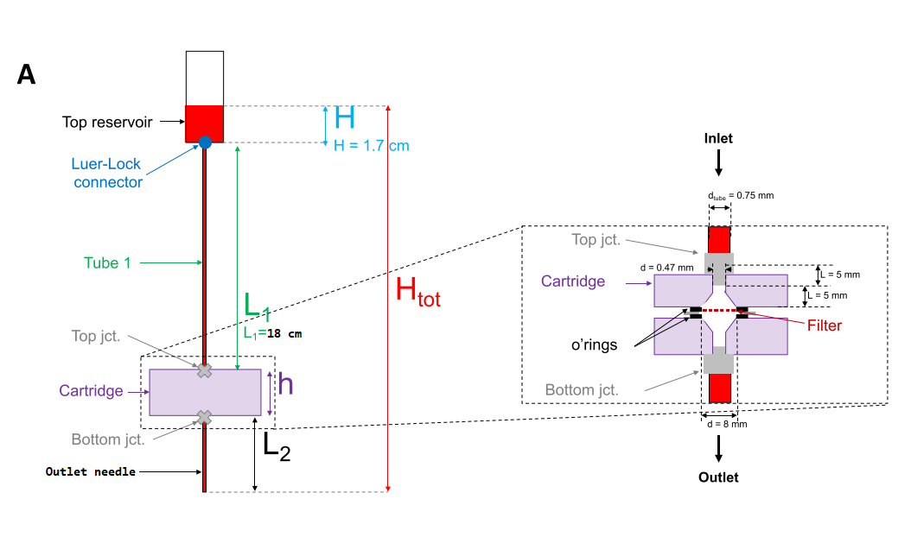

# SOP GuF Small #
Last update: 2020-08-18, NC

## Abbreviations ##
- DW: distilled water
- Q: flow rate

## Materials ##
- Outlet needle: 26 Ga blunt steel dispensing needle, beige (McMaster 75165A257)
- Tubing: 1/32" ID, 3/32" OD (_e.g.,_ McMaster 5233K91)

# CTC CAPTURE BY GRAVITY FILTRATION #

*All solutions should be filtered/prepared using filtered PBS in order to reduce dust on the filters. Wash the cartridges and o-rings with DW before use.*

## Coat Filters in BSA ##

- Why: To prevent non-specific adsorption and reduce WBCs sticking to filter
- Incubate filters overnight in 2% BSA in PBS at 4C
- Filters may be loaded into the cartridge directly from their BSA bath. Filters not to be used immediately are placed be in a dish or well plate and stored until use.

## Loading filter on cartridge ##

_I've found it preferable to load the bolts from the top to the bottom of the cartridge as this results in the screws extending past the outlet and they can act as legs to stand on during the fixation and permiabilization steps._

1. Place the first o ring inside the notch
2. Add the 8um filter
3. Add the second o ring, followed by the silicone gasket
4. Repeat [1-3] with the stacking adapter and the 15um filter
5. Place the stacking assembly onto the base assembly, ensuring that their holes line up and are not obstructed by o rings
6. Place the top of the cartridge, aligning the o ring on top of the 15um filter with the notch. It may be easier to insert the bolts through the top cartridge before doing this.
7. Insert the bolts from top to bottom. Attach nuts to the bottom and tighten the assembly. This can be done without any tools (_i.e.,_ pinching the bolt and tightening the nut) and in my experience finger-tight is tight enough to run filtration without leaking.

## Platform setup and preload ##

1. Connect the dispensing needle to the outlet and clamp the cartridge onto a retort stand.
2. Remove the plunger from a 60 ml syringe to create a reservoir and connect it to the L1 tube (18 cm). Loosely clamp above the catridge
3. With slack in the L1, connect it to the catridge inlet. Pull the reservoir up to remove the slack and then clamp the reservoir at this height. The reservoir and L1 should be aligned as directly above the cartridge inlet as you can reasonably achieve.
4. Place something under the outlet to collect the filtrate (_e.g.,_ falcon tube, glass dish).
5. Preload system with 0.05% pluronic/PBS. Pour 10 ml into the reservoir and gently press down with the plunger to initiate flow. Remove the plugner, you should see solution dripping from the outlet needle at a steady rate.
6. Check the system for leaks and do a sanity check on the flow rate. The target flow rate ceiling for a 8 um 40% porosity filter 8 mm in diameter is 0.5 ml/min. As of writing, the system as configured should give ballpark 0.25 to 0.45 ml/min. If flow seems too fast or very slow, measure it by collecting filtrate in intervals and weighing. If very slow, check that the tubing is in good condition and check that none of the o-rings have shifted and are partially obscuring the fludic path in the cartridge. If very fast **TODO too fast troubleshooting**.
7. When you are ready to proceed, allow the preload solution to flow until it reaches the 0-level on the reservoir (the bottom gradation on the syringe, there should still be solution in the reservoir and no air in the system.
8. Use a pair of hemostats to clamp L1 near the cartridge to stop flow (you should be able to rest the hemostats against the cartridge and leave them there). Do this while the PBS pluronic is flowing, this way you can resume flow simply by unclamping L1 and avoid using the plunger.

## Sample filtration ##

_I find a pair of hemostats (or whatever you call your locking forceps) the easiest way to release/clamp L1. Runtime is dependent on the volume of the sample as well as how much stuff has collected on the filter. I would expect anywhere from_

1. Dilute the blood sample 1:6 with 0.05% pluronic/PBS and gently mix by inversion or light vortexing.
2. Pour the sample into the reservoir and release L1. You should see the sample begin to flow into the cartridge and the color of the filtrate will gradually become more red in color.
3. You can expect to see some minor phase separation in the reservoir over time. When you notice this you can gently remix the reservoir using a P1000. It would probably be prudent to clamp L1 when you do this, but I won't tell if you don't.
4. Allow the sample to filter until the level reaches the 0 to 2 ml mark on the reservoir and clamp L1. If backrinsing, you can prepare the pump and preload your syringes during this time.
5. **Forward rinse:** add 5 ml of 0.05% pluronic and release L1. If you are **not** doing any backrinsing, repeat steps 4-5 two more times (3 forward rinses total). 
6. Allow the system to drain completely (no fluid visible in L1, nothing coming out of outlet). If not doing backrinse, remove the outlet needle (I use serrated forceps to hold the fluidic interface and then turn the needle with my fingers), and move onto fixation/staining.  
7. **Backrinse:** disassemble the cartridge stack and assemble the 8 and 15 um filters into individual cartrides. Clamp cartridges onto stands.
8. Connect two syringes to lengths of tubing long enough to reach the cartridges and load with >3 ml PBS (no air). Connect the tubes to the cartridge outlets and the syringes to the syringe pump.
9. Infuse 2 ml PBS at 0.5 ml/min. Clamp L1, disconnect the tubing from the outlet, and attach an outlet needle.
10. Release L1 and allow the system to drain completely. 

----
# Scratchpad #

Wouldn't it be way more convinient to do fixation with the system still in the stand? I guess the issue with this is that it prohibits you from placing the system on a rocker during the incubations/rinses. And TBH it isn't that much of a hassle to use the P1000/luer plugs.

